# Learning Management System (LMS)

A full-stack Learning Management System built to manage online courses, learning modules, enrollments, assignments, submissions, reviews, and student progress through separate Student and Admin workflows.

This project was developed as an academic/training LMS project and implements the complete core workflow from user authentication and course enrollment to learning progress and assignment evaluation.

## Project Objectives

The project aims to provide a centralized platform where:

- Students can register, log in, browse courses, enroll, access learning modules, complete modules, track progress, view assignments, submit work, and view marks/feedback.
- Administrators can manage courses, modules, assignments, students, submissions, and student progress.
- Authentication, authorization, validation, and protected workflows are handled through a Node.js/Express backend.
- Application data is stored persistently in MongoDB.

## Key Features

### Student Module

- Student registration and login
- JWT-based authentication
- Browse available courses
- View course details
- Enroll in courses
- View enrolled courses
- Continue learning from the dashboard
- Access ordered course modules
- Open learning resource links
- Mark modules as completed
- Automatic course progress calculation
- Persistent progress after refresh/login
- View course completion status
- View course assignments
- Submit assignments using a submission link
- Assignment deadline validation
- Duplicate submission prevention
- View submission history
- View marks, status, and instructor feedback
- Profile and authenticated navigation

### Admin Module

- Protected Admin dashboard
- Dashboard statistics for students, courses, modules, assignments, and submissions
- Create, view, edit, and delete courses
- Set category, duration, difficulty, description, and optional image
- Create, view, edit, delete, and order course modules
- Automatic module re-indexing after deletion
- Add learning resource links
- Create, view, edit, and delete assignments
- Configure assignment deadlines and maximum marks
- View registered students
- View student enrollment and progress data
- View assignment submissions
- Open submitted work
- Assign marks with maximum-mark validation
- Add instructor feedback
- Update submission review status

### Security & Validation

- Password hashing using bcrypt
- JWT authentication
- Authentication middleware for protected APIs
- Role-based Student/Admin authorization
- Protected frontend page redirects
- MongoDB ObjectId validation
- Required-field validation
- Course/module/assignment/submission validation
- Enrollment ownership checks
- Module/course relationship checks
- Duplicate enrollment protection
- Duplicate assignment submission protection
- Assignment deadline enforcement
- Marks range validation
- Student-only and Admin-only API protection
- Appropriate 400, 401, 403, 404, and 500 error handling

## Technology Stack

| Layer | Technologies |
| --- | --- |
| Frontend | HTML5, CSS3, JavaScript |
| Backend | Node.js, Express.js |
| Database | MongoDB, Mongoose |
| Authentication | JSON Web Token (JWT), bcryptjs |
| API Style | REST API |
| Development | VS Code, Nodemon |
| Version Control | Git, GitHub |

## System Architecture

```text
Browser / Frontend
        |
        | HTTP / REST API
        v
Node.js + Express.js Backend
        |
        | Mongoose ODM
        v
      MongoDB
```

The frontend communicates with the Express REST API. Authentication tokens identify the logged-in user, middleware protects restricted endpoints, role middleware separates Student and Admin operations, and Mongoose models persist data in MongoDB.

## Project Structure

```text
KrushnaManthalkar_LMS/
├── backend/
│   ├── config/
│   │   └── db.js
│   ├── middleware/
│   │   ├── authMiddleware.js
│   │   └── roleMiddleware.js
│   ├── models/
│   │   ├── Assignment.js
│   │   ├── Course.js
│   │   ├── Enrollment.js
│   │   ├── Module.js
│   │   ├── Submission.js
│   │   └── User.js
│   ├── routes/
│   │   ├── adminRoutes.js
│   │   ├── assignmentRoutes.js
│   │   ├── authRoutes.js
│   │   ├── courseRoutes.js
│   │   ├── enrollmentRoutes.js
│   │   ├── moduleRoutes.js
│   │   ├── progressRoutes.js
│   │   └── submissionRoutes.js
│   ├── utils/
│   │   └── validation.js
│   ├── package.json
│   └── server.js
├── frontend/
│   ├── css/
│   │   └── style.css
│   ├── js/
│   │   └── JavaScript files for individual pages/workflows
│   ├── admin-dashboard.html
│   ├── admin-courses.html
│   ├── admin-modules.html
│   ├── admin-assignments.html
│   ├── admin-students.html
│   ├── admin-submissions.html
│   ├── assignments.html
│   ├── course-details.html
│   ├── courses.html
│   ├── dashboard.html
│   ├── login.html
│   ├── modules.html
│   ├── my-courses.html
│   ├── profile.html
│   ├── progress.html
│   ├── register.html
│   └── submission.html
└── README.md
```

## Database Design

The application uses MongoDB through Mongoose.

### User

Stores registered users and their roles.

Main fields:
- `name`
- `email`
- `password` (hashed)
- `role` — Student or Admin

### Course

Stores course information.

Main fields:
- `title`
- `description`
- `category`
- `instructor`
- `duration`
- `difficulty`
- `image`

### Module

Stores learning modules belonging to a course.

Main fields:
- `courseId`
- `title`
- `description`
- `resourceLink`
- `moduleOrder`

Modules are ordered per course.

### Assignment

Stores course assignments.

Main fields:
- `courseId`
- `title`
- `description`
- `deadline`
- `maximumMarks`

### Enrollment

Connects students to enrolled courses and stores learning progress.

Main fields:
- `studentId`
- `courseId`
- `enrollmentDate`
- `completedModules`
- `progress`
- `status`

A student can enroll in a course only once.

### Submission

Stores student assignment submissions and Admin reviews.

Main fields:
- `assignmentId`
- `studentId`
- `submissionLink`
- `submissionDate`
- `marks`
- `feedback`
- `status`

A student can submit an assignment only once.

## Main Application Workflows

### Student Learning Flow

```text
Register / Login
      ↓
Browse Courses
      ↓
View Course
      ↓
Enroll
      ↓
My Courses / Dashboard
      ↓
Continue Learning
      ↓
Course Modules
      ↓
Complete Module
      ↓
Progress Updated
      ↓
Progress Persists
      ↓
Course Completed at 100%
```

### Assignment Flow

```text
Student Opens Assignment
        ↓
Submits Work Link
        ↓
Backend Validates Enrollment + Deadline + Duplicate Submission
        ↓
Admin Reviews Submission
        ↓
Marks + Feedback + Status Saved
        ↓
Student Views Review
```

## REST API Overview

Base URL during local development:

```text
http://localhost:5000
```

### Authentication

| Method | Endpoint | Access | Purpose |
| --- | --- | --- | --- |
| POST | `/api/auth/register` | Public | Register a student |
| POST | `/api/auth/login` | Public | Log in |
| GET | `/api/auth/me` | Authenticated | Get current user |

### Courses

| Method | Endpoint | Access | Purpose |
| --- | --- | --- | --- |
| GET | `/api/courses` | Public | List courses |
| GET | `/api/courses/:id` | Public | Get a course |
| POST | `/api/courses` | Admin | Create course |
| PUT | `/api/courses/:id` | Admin | Update course |
| DELETE | `/api/courses/:id` | Admin | Delete course |

### Enrollments

| Method | Endpoint | Access | Purpose |
| --- | --- | --- | --- |
| POST | `/api/enrollments` | Student | Enroll in course |
| GET | `/api/enrollments/my` | Student | Get enrolled courses |
| GET | `/api/enrollments/:courseId` | Student | Get enrollment for course |

### Modules

| Method | Endpoint | Access | Purpose |
| --- | --- | --- | --- |
| GET | `/api/modules/course/:courseId` | Authenticated | Get course modules |
| POST | `/api/modules` | Admin | Create module |
| PUT | `/api/modules/:id` | Admin | Update module |
| DELETE | `/api/modules/:id` | Admin | Delete module |

### Assignments

| Method | Endpoint | Access | Purpose |
| --- | --- | --- | --- |
| GET | `/api/assignments/course/:courseId` | Authenticated | Get course assignments |
| POST | `/api/assignments` | Admin | Create assignment |
| PUT | `/api/assignments/:id` | Admin | Update assignment |
| DELETE | `/api/assignments/:id` | Admin | Delete assignment |

### Submissions

| Method | Endpoint | Access | Purpose |
| --- | --- | --- | --- |
| POST | `/api/submissions` | Student | Submit assignment |
| GET | `/api/submissions/my` | Student | Get own submissions |
| GET | `/api/submissions/assignment/:assignmentId` | Admin | Get assignment submissions |
| PUT | `/api/submissions/:id` | Admin | Review submission |

### Progress

| Method | Endpoint | Access | Purpose |
| --- | --- | --- | --- |
| GET | `/api/progress/:courseId` | Student | Get course progress |
| POST | `/api/progress/:courseId/module/:moduleId/complete` | Student | Complete a module |

### Admin

| Method | Endpoint | Access | Purpose |
| --- | --- | --- | --- |
| GET | `/api/admin/dashboard` | Admin | Dashboard statistics |
| GET | `/api/admin/students` | Admin | View students |
| GET | `/api/admin/student-progress` | Admin | View student progress |

## Installation and Local Setup

### Prerequisites

Install:

- Node.js
- npm
- MongoDB locally or use MongoDB Atlas
- Git
- A modern web browser

### 1. Clone the repository

```bash
git clone https://github.com/KrushnaManthalkar/KrushnaManthalkar_LMS.git
cd KrushnaManthalkar_LMS
```

### 2. Install backend dependencies

```bash
cd backend
npm install
```

### 3. Configure environment variables

Create a `.env` file inside the `backend` directory:

```env
MONGO_URI=your_mongodb_connection_string
JWT_SECRET=your_secure_jwt_secret
PORT=5000
```

Do not commit the `.env` file. It is excluded from Git through `.gitignore`.

### 4. Start the backend

Development mode:

```bash
npm run dev
```

or:

```bash
npm start
```

The API runs on `http://localhost:5000` by default.

### 5. Start the frontend

Serve the `frontend` directory using a local web server such as the VS Code Live Server extension, then open the application in your browser.

> If the frontend API base URL is changed for deployment, update the frontend configuration/code to point to the deployed backend URL.

## Environment Variables

| Variable | Required | Description |
| --- | --- | --- |
| `MONGO_URI` | Yes | MongoDB connection string |
| `JWT_SECRET` | Yes | Secret used to sign and verify JWTs |
| `PORT` | No | Backend port; defaults to 5000 |

Never expose real credentials or secrets in the repository.

## Testing

The completed LMS workflow has been tested across the major Student and Admin flows.

Testing covered:

- Registration and login
- Authentication and role-based authorization
- Protected page/API access
- Course CRUD
- Course enrollment
- Duplicate enrollment handling
- Module CRUD and ordering
- Module completion
- Progress calculation and persistence
- Assignment CRUD
- Assignment submission
- Enrollment verification before submission
- Deadline validation
- Duplicate submission prevention
- Submission review
- Marks validation
- Instructor feedback
- Student/Admin navigation
- Invalid IDs and invalid requests
- Responsive UI behavior

## Development Progress

| Phase | Work | Status |
| --- | --- | --- |
| 1 | Admin Course Management | ✅ Completed |
| 2 | Admin Module Management | ✅ Completed |
| 3 | Admin Assignment Management | ✅ Completed |
| 4 | Admin Submission Review | ✅ Completed |
| 5 | Admin Students & Progress | ✅ Completed |
| 6 | Student Learning & Workflow Completion | ✅ Completed |
| 7 | Security & Validation Audit | ✅ Completed |
| 8 | Complete Workflow & UI Testing | ✅ Completed |

### Phase 1 — Admin Course Management

- Course CRUD
- Category, duration, difficulty, description, and image support
- Admin-only write operations
- Backend persistence

### Phase 2 — Admin Module Management

- Module CRUD
- Course-based module listing
- Module ordering
- Re-indexing after deletion
- Learning resource links
- Admin protection

### Phase 3 — Admin Assignment Management

- Assignment CRUD
- Deadlines
- Maximum marks
- Course assignment listing
- Admin protection

### Phase 4 — Admin Submission Review

- View submissions by assignment
- Open submitted work
- Marks validation
- Feedback and status updates
- Student access to review results

### Phase 5 — Admin Students & Progress

- Registered student listing
- Enrolled course counts
- Student enrollment/progress visibility
- Admin-only access

### Phase 6 — Student Learning & Workflow Completion

- Dashboard continuation flow
- Enrolled course learning navigation
- Module completion and persistence
- Progress page
- Assignment submission workflow
- Submission history
- Marks/feedback visibility
- Navigation and responsive UI improvements

### Phase 7 — Security & Validation Audit

- Authentication protection verified
- Student/Admin authorization verified
- Protected APIs checked
- ObjectId and request validation added
- Ownership and enrollment checks verified
- Duplicate enrollment/submission protection
- Assignment deadline validation
- Marks validation
- Frontend route guards verified
- Error-handling scenarios tested

### Phase 8 — Complete Testing

- Student end-to-end flow tested
- Admin end-to-end flow tested
- Student/Admin interaction tested
- Data persistence checked
- Navigation checked
- Security/validation scenarios checked
- Responsive behavior checked

## Screenshots

The screenshot gallery documents the major LMS pages and workflows required by the project brief. Screenshots are grouped by the actual Student and Admin functionality implemented in the application.

Store the image files in:

```text
docs/screenshots/
```

### 1. Authentication

#### Login

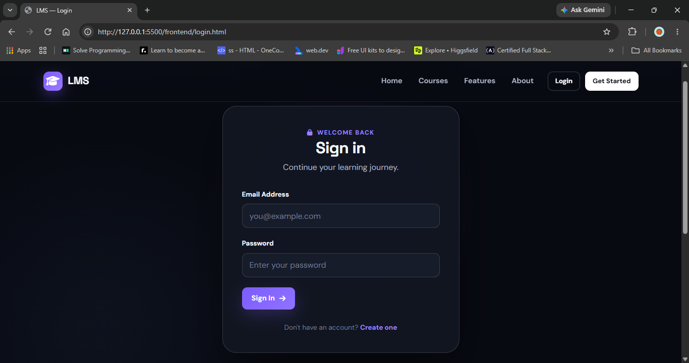

#### Registration

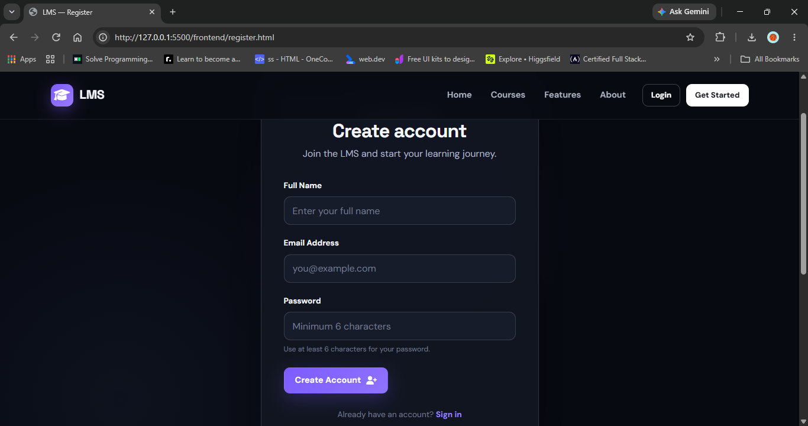

### 2. Student Dashboard

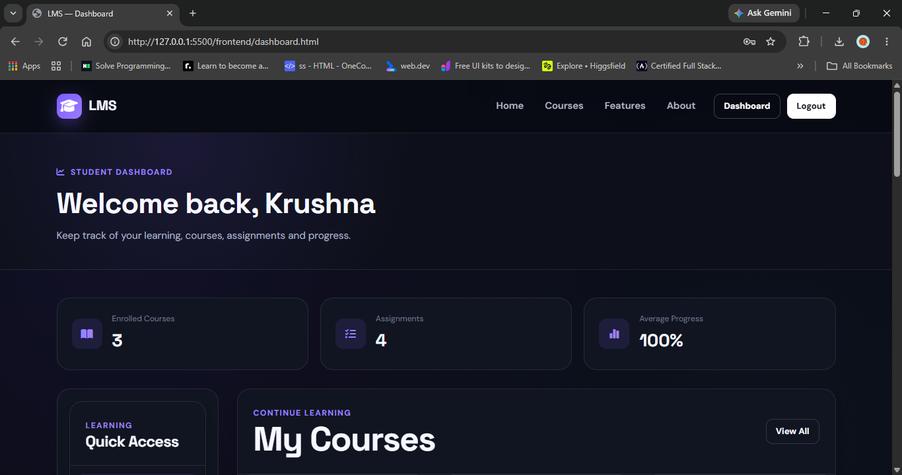

### 3. Course Catalog

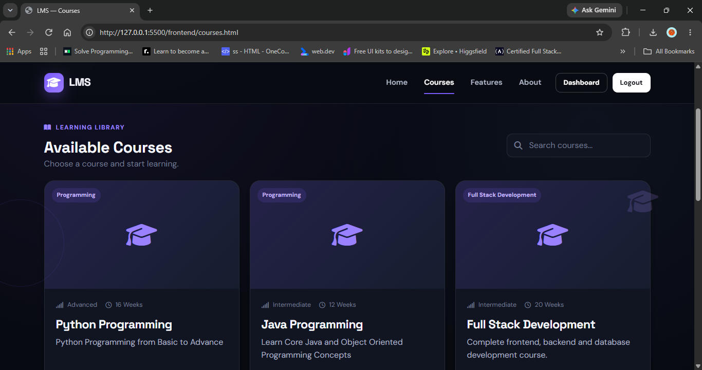

### 4. Course Details & Enrollment

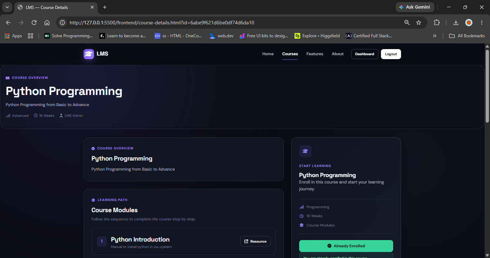

### 5. My Courses

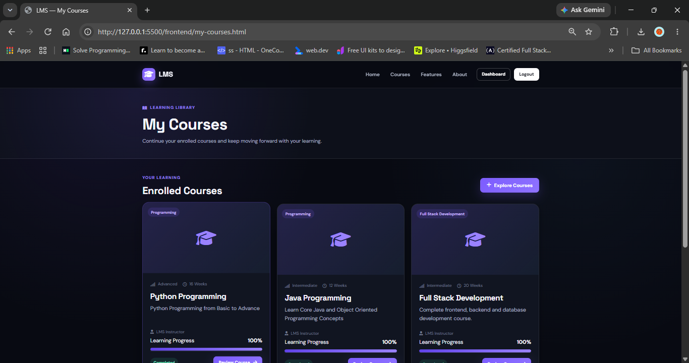

### 6. Learning Modules

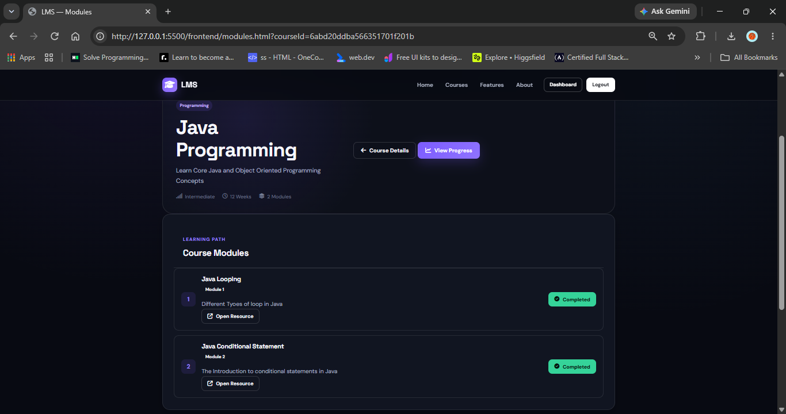

### 7. Assignments

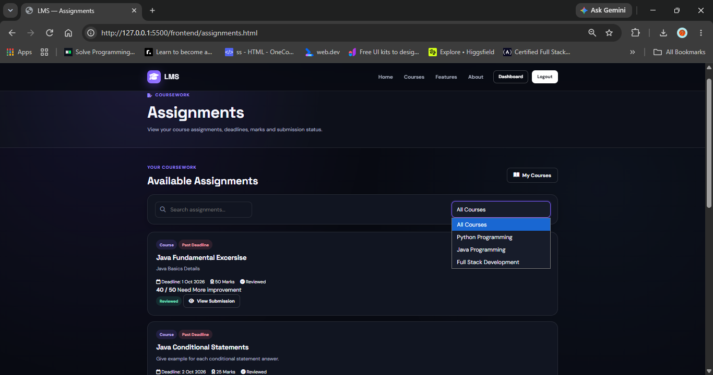

### 8. Assignment Submission

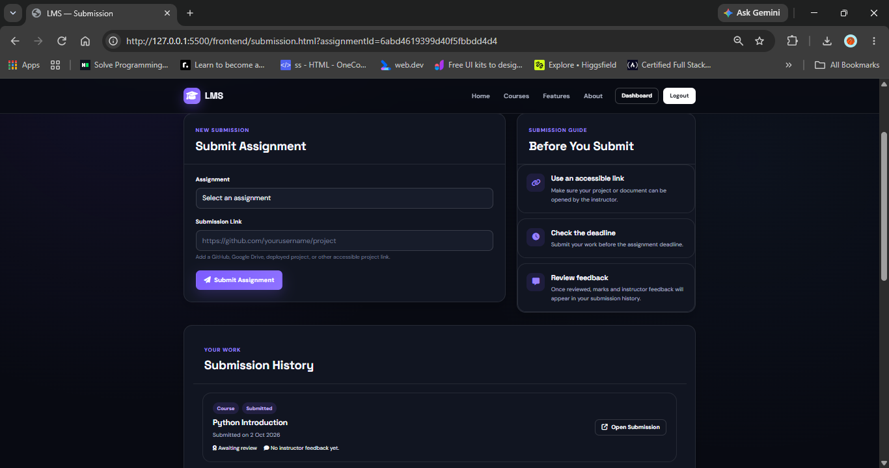

### 9. Student Progress

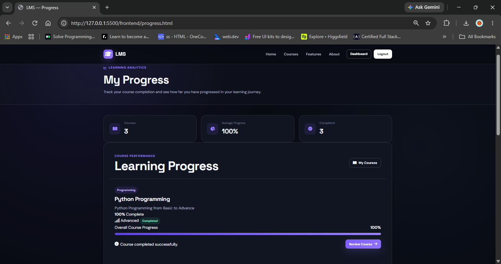

### 10. Admin Dashboard

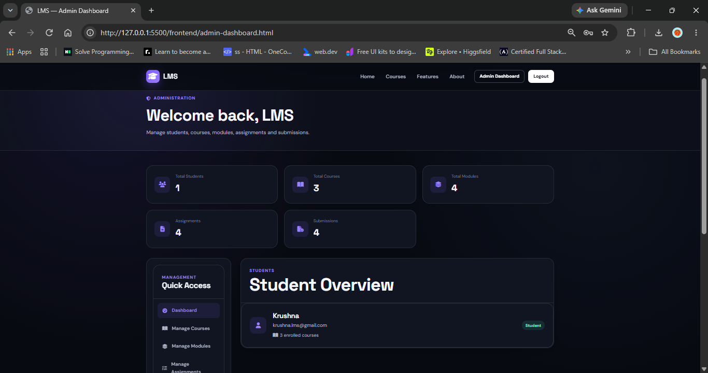

### 11. Admin Course Management

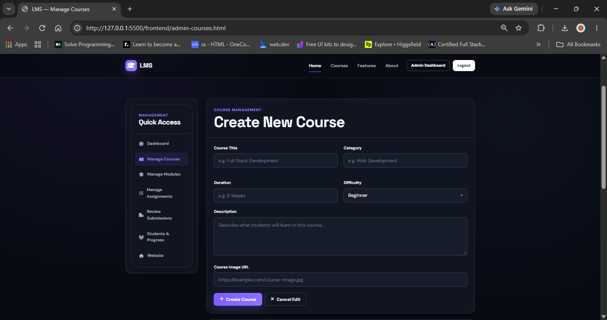

### 12. Admin Module Management

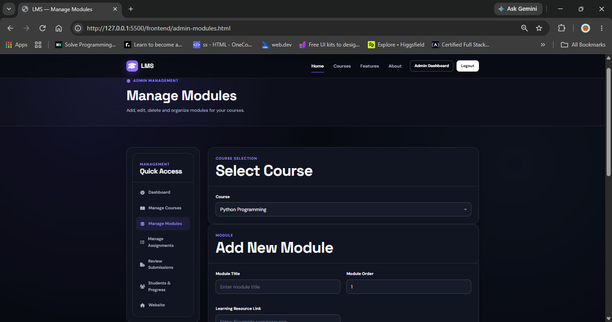

### 13. Admin Assignment Management

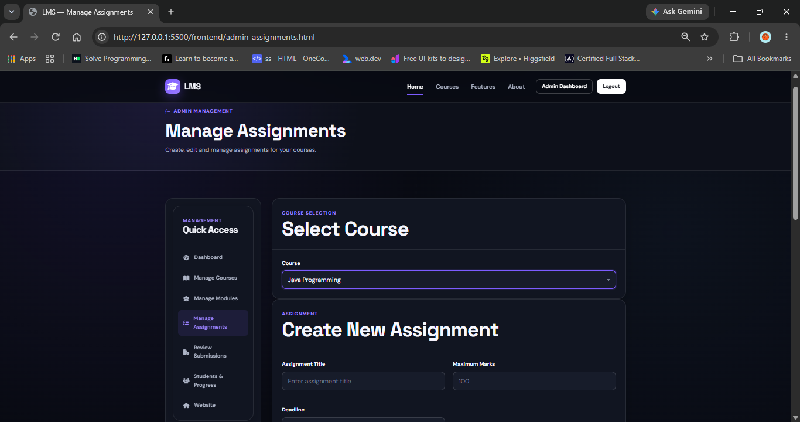

### 14. Admin Submission Review

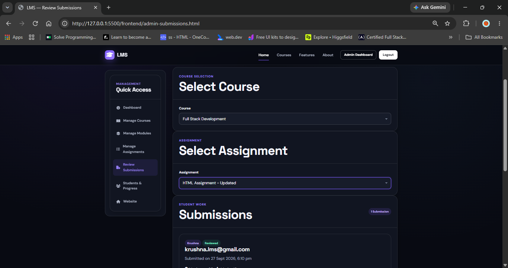

### 15. Admin Students & Progress

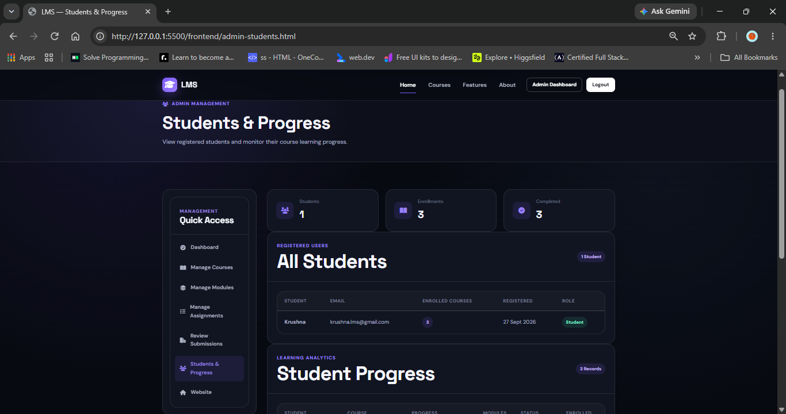

### 16. Responsive Mobile Layout

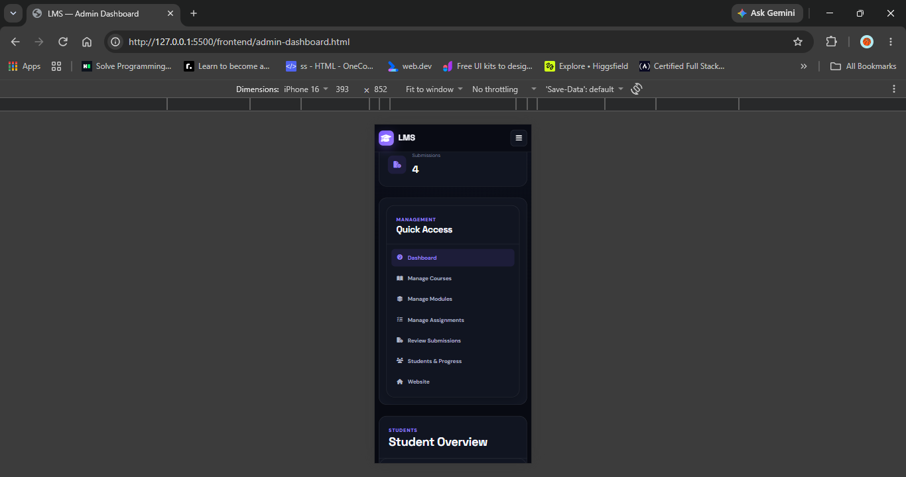

### Screenshot Coverage

| Project Area | Covered Screenshots |
| --- | --- |
| Authentication | Login, Registration |
| Student Experience | Dashboard, Courses, Course Details, My Courses |
| Learning | Modules, learning resources, module completion |
| Assessment | Assignments, Assignment Submission |
| Progress Tracking | Student Progress |
| Administration | Admin Dashboard, Courses, Modules, Assignments |
| Submission Review | Admin Submission Review |
| Student Monitoring | Admin Students & Progress |
| Responsive Design | Mobile Layout |


## Deployment

The project currently supports local execution. A public deployment URL has not been added to this repository yet.

For deployment, the frontend and backend can be hosted separately, with the backend configured using secure environment variables and a MongoDB database connection. After deployment, add the final live application URL here.

## Project Deliverables

| Deliverable | Status |
| --- | --- |
| Complete source code | ✅ Complete |
| GitHub repository | ✅ Complete |
| Core LMS functionality | ✅ Complete |
| Student/Admin workflows | ✅ Complete |
| Security & validation audit | ✅ Complete |
| Full workflow testing | ✅ Complete |
| README documentation | ✅ Complete |
| Database structure documentation | ✅ Included in this README |
| Screenshot gallery structure | ✅ Documented |
| Project report | Documentation-ready |
| Project presentation | Documentation-ready |
| Demonstration video | Documentation-ready |
| Live deployment link | Optional |

## Future Improvements

Possible future enhancements include:

- Separate learning material types for PDFs, videos, source code, and practice resources
- File upload support instead of link-only submissions/resources
- Search and filtering improvements
- Course announcements and notifications
- Quizzes and automated assessments
- Certificates after course completion
- Email notifications
- Password reset flow
- Pagination for large datasets
- Rich-text course/module content
- Cloud file storage
- Automated API/unit/integration tests
- Public cloud deployment

## Repository

GitHub repository: [KrushnaManthalkar/KrushnaManthalkar_LMS](https://github.com/KrushnaManthalkar/KrushnaManthalkar_LMS)

## Author

**Krushna Manthalkar**

MCA Student  
Nutan Maharashtra Institute of Engineering and Technology (NMIET)

## Project Status

**Core LMS Development: Completed ✅**

The main Student and Admin LMS workflows, backend/database integration, authentication, authorization, validation, progress tracking, assignment submission/review, responsive UI, documentation, and final workflow testing are complete. The README includes the complete screenshot gallery structure for the project's major pages and workflows.
